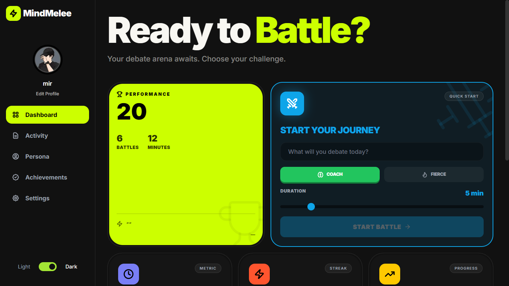
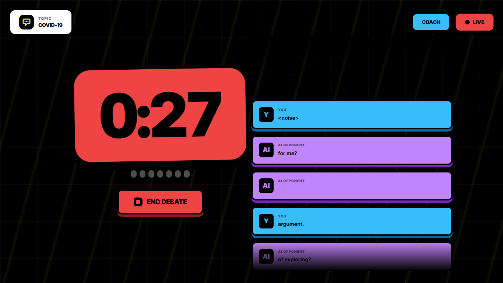
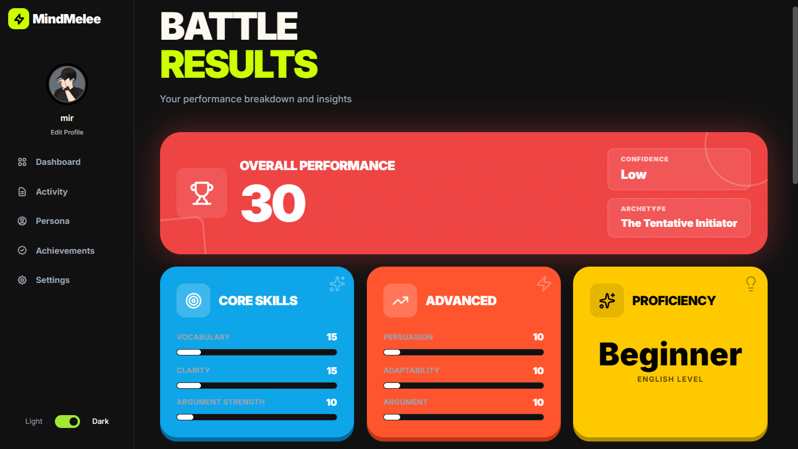

# MindMelee

**Your Voice-Powered Debate Training Platform**

Practice debating anytime, anywhere with real-time voice interaction and instant feedback.


---

## Features

**Real-Time Voice Debates** - Powered by Google Gemini Live API  
**Bold Neubrutalist UI** - CodeJam-inspired design with smooth animations  
**Comprehensive Analytics** - Track 10+ performance metrics  
**Dual AI Modes** - Coach (supportive) or Fierce (challenging)  
**Progress Tracking** - Visualize improvement over time  
**Persona Discovery** - Identify your unique debate style  

---

## Quick Start

```bash
git clone https://github.com/abbasmir12/mindmelee.git
cd mindmelee
npm install
npm run dev
```

Visit `http://localhost:5173` and add your Gemini API key in Settings.

---

## How It Works

1. **Choose Your Topic** - Pick any debate subject
2. **Select Mode** - Coach for learning, Fierce for challenge
3. **Start Debating** - Speak naturally, AI responds in real-time
4. **Get Feedback** - Receive detailed performance analysis

---

## Built With

- React 18 + TypeScript
- Framer Motion
- Tailwind CSS
- Google Gemini Live API
- Recharts
- Vite

---

## Screenshots

### Dashboard


### Live Debate


### Analytics


---

## License

MIT License - see [LICENSE](LICENSE) for details

---

## Contributing

Contributions welcome! Please open an issue or submit a pull request.
